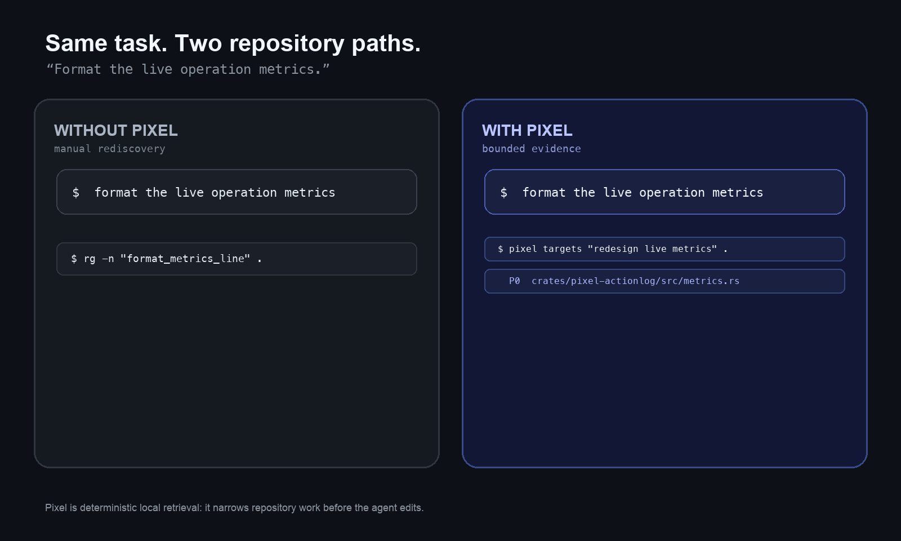
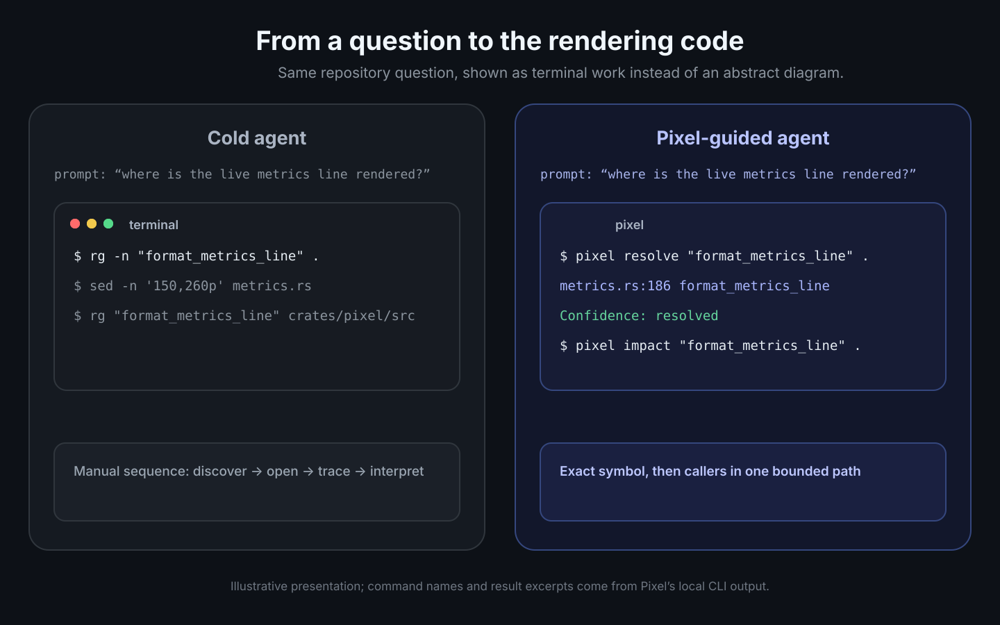
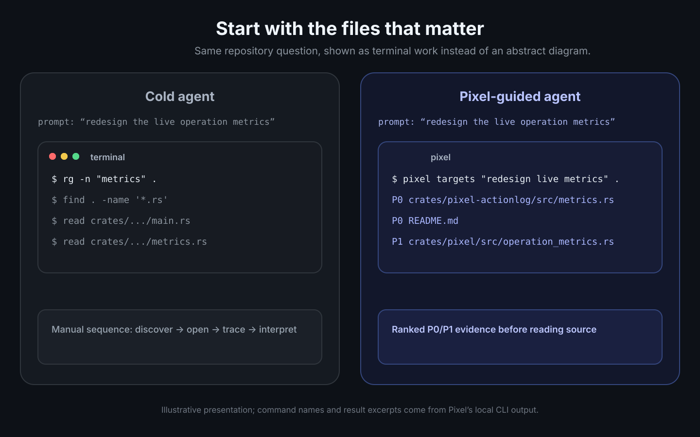
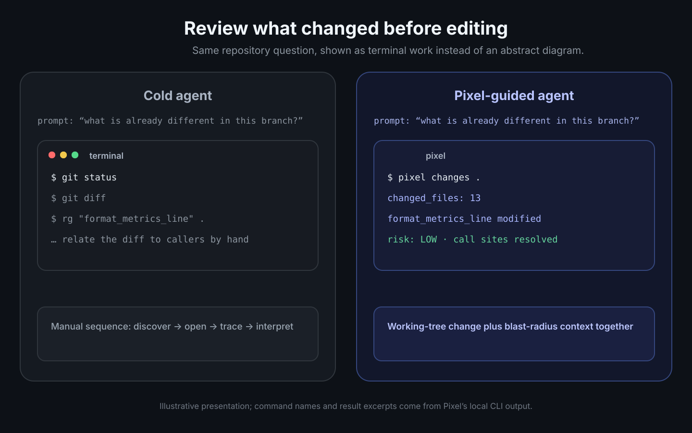
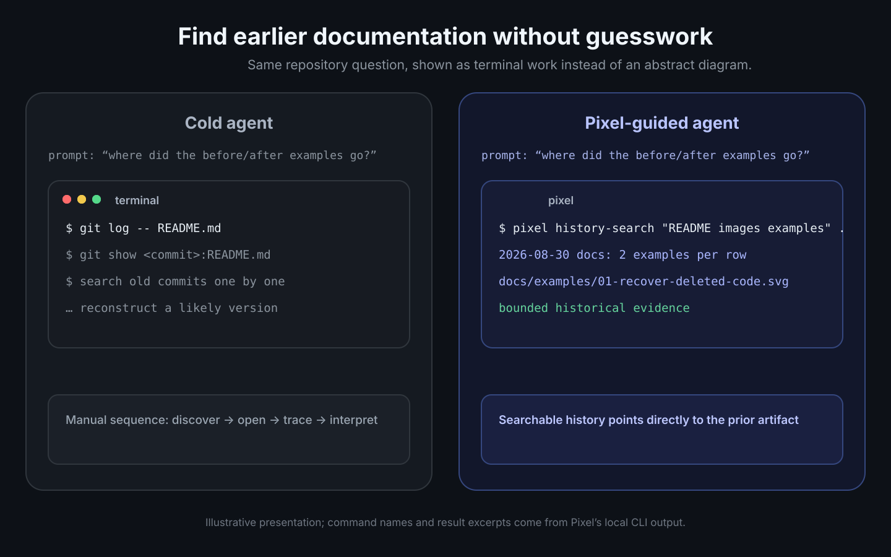

# 🟩 Pixel

> **A local control layer that helps coding agents spend less time on simple repository work.**

Pixel is not just a search box. It is the control layer for the whole path from a task to a safe Git change.

Pixel runs locally, connects repository structure with repository history, and returns evidence with boundaries. When it cannot prove that an answer is complete, it says so.

## 🎯 The goal

Make as much repository work deterministic as possible. If something can be answered or carried out from repository state, history, structure, or a proven flow, Pixel should do it directly—with evidence, clear boundaries, and safe recovery. Genuine ambiguity is where the agent should spend its time.

<p align="center">
  
</p>

## ⭐ The Pixel Flow Power

```text
task → targets → resolve → impact → edit → changes → review → publish
```

<p align="center">
  
</p>

## 💡 See the difference

The same repository questions, shown as realistic terminal work. These are workflow illustrations using actual Pixel command names and local output excerpts—not performance benchmarks.

<p align="center">
  
  
  
  
</p>

## 🚀 Start here

```bash
brew tap LivioGama/tap
brew install pixel
pixel prepare-repo .       # optional warm-up
pixel doctor .      # optional health check
pixel install       # let your agent use Pixel
```

`pixel install` deploys the agent system prompt and wires it into the agents it knows:

| Agent | How the prompt reaches it |
| --- | --- |
| Claude Code | a `claude` shell function adds `--append-system-prompt-file` (and the short sub-agent prompt in print mode) |
| Codex | the `developer_instructions` key of `~/.codex/config.toml`, so every front end gets it |
| Pi | `~/.pi/agent/APPEND_SYSTEM.md`, read automatically |

> [!NOTE]
> Any other agent (Cursor, Gemini CLI, Copilot, ...) is not wired by `pixel install` and will not know about Pixel on its own. Give it the same prompt through its own rules or system-prompt mechanism; see [Other agents and manual setup](#-other-agents-and-manual-setup).

| Need | Pixel command |
| --- | --- |
| Find text, a symbol, or a concept | `pixel search-content`, `pixel find-code`, `pixel search-meaning` |
| Scope work and see risk | `pixel scope-task`, `pixel impact`, `pixel what-changed` |
| Recover prior code or history | `pixel dig-history`, `pixel search-history`, `pixel plan-rollback` |
| Resolve a term the index cannot know | `pixel web-search` — deterministic fetch (SearXNG via `PIXEL_WEB_SEARCH_URL`, else DuckDuckGo/Wikipedia), no LLM |
| Review or safely publish | `pixel repo-state`, `pixel review-changes`, `pixel sync-branch`, `pixel commit` |

Pixel is local-first. Its index, graph, and optional history data live under `.pixel/`; it reports boundaries when results are capped, stale, or incomplete. Tests and code review remain necessary.

### ⬆️ Updating

Upgrading replaces the binary only. The agent prompt, shell wrapper and
per-agent config keys are written by `pixel install` into your home — they
are yours, not the package manager's — so they keep the old release's text
until you refresh them. `pixel doctor .` reports the wiring as missing or
stale until you do.

| Installed with | Upgrade the binary |
| --- | --- |
| Homebrew | `brew update && brew upgrade LivioGama/tap/pixel` |
| mise | `mise upgrade pixel` |
| `install.sh` | `curl -fsSL https://github.com/LivioGama/pixel/releases/latest/download/install.sh \| sh` |
| Source checkout | `pixel self-update` rebuilds and reinstalls the running binary; it refuses to write into a Homebrew Cellar or a mise install |

Then, whatever the channel, refresh the wiring and check it:

```bash
pixel install
pixel doctor .
```

### Plugin install (per-tool native)

This repo carries native plugin manifests, so each agent CLI can install Pixel's protocol through its own plugin mechanism — no `pixel install` step. The `pixel` binary still has to be installed (see above); the plugin never installs it. Always-on delivery is a SessionStart/SubagentStart hook (`hooks/pixel-context.sh`) that injects the protocol as `additionalContext` (the short sub-agent prompt for sub-agents) — context only, it never blocks a tool call. When `pixel` is missing from PATH, or too old for the command names the protocol uses, the hook injects a one-paragraph notice instead.

> [!NOTE]
> The commands below read the default branch `main`, which can be ahead of the latest release. When the installed `pixel` is too old for the command names the protocol uses, the hook injects its notice instead of the protocol: update the binary.

| Tool | Install |
| --- | --- |
| Claude Code | `/plugin marketplace add LivioGama/pixel` then `/plugin install pixel@pixel` |
| Codex | `codex plugin marketplace add LivioGama/pixel` then `codex plugin add pixel@pixel` |
| Copilot CLI | `copilot plugin marketplace add LivioGama/pixel` then `copilot plugin install pixel@pixel` |
| Devin | Add `github.com/LivioGama/pixel` as a Devin plugin — it picks up `.devin-plugin/` + `.cursor/rules/pixel.mdc` |
| Gemini CLI | `gemini extensions install https://github.com/LivioGama/pixel` |
| Pi | `pi install git:github.com/LivioGama/pixel` |
| OpenCode | `"plugin": ["@liviogama/pixel"]` in `opencode.json` (or `"./.opencode/plugins/pixel.mjs"` from a checkout) |
| Cursor / Windsurf / Kiro / Cline / Qoder | Rules ship under `.cursor/rules/`, `.windsurf/rules/`, `.kiro/steering/`, `.clinerules/`, `.qoder/rules/` — copy or vendor into your project |
| Anything else | `PIXEL.md` at the repo root is the plain-markdown protocol — paste it into whatever instruction surface the tool offers |

Generated surfaces (`skills/`, `PIXEL.md`, `PIXEL-SUBAGENT.md`, all rules files) come from the prompts in `crates/pixel-install/assets/` via `scripts/gen-plugin-assets.sh`; a test fails if they drift, and `pixel check-release` fails a release whose plugin manifests do not carry its version.

### 🔌 Other agents and manual setup

Using an agent the installer does not cover, or prefer to control your own setup? Deploy the agent
system prompt and wire it into your agent by hand — see
[Manual Setup](docs/manual-setup.md). The prompt itself lives at
[`crates/pixel-install/assets/pixel-agent-prompt.md`](crates/pixel-install/assets/pixel-agent-prompt.md)
(~275 lines / ~4 150 tokens) and is the single source of truth: every agent, installed or manual, should read that exact text.

> [!TIP]
> It's large because Pixel replaces a wide range of native commands (`grep`, `rg`, `git log -S`, `git blame`, manual caller tracing) with a single indexed workflow — and the token cost is recovered in as little as one `pixel impact` call.

For architecture and the full command surface, see [ARCHITECTURE.md](ARCHITECTURE.md) and `pixel --help`.
To build from source, run the gates, or open a pull request (with or without an AI agent), see [CONTRIBUTING.md](CONTRIBUTING.md).

## 🔁 Renamed commands

Every subcommand got a verb-first name after 0.2.4 (for example `prepare-repo`
instead of `ready`). The old names stay accepted as hidden aliases until
**1.0**, so scripts, hook entries and agent prompts written for 0.2.x keep
working. Invoking an old name prints one line on stderr naming the new one:

```
note: 'ready' is now 'prepare-repo'; the old name stays accepted until 1.0
```

The note is never written to stdout, so `--json` output is unchanged. Like
the metrics line, it is silenced by `--metrics off` or `PIXEL_METRICS=0`,
and never appears in hook responses or `search-like-rg` output. Protocol op
names and JSON fields did not change. `migrate` was removed: it now exits 0
with a note and does nothing.

| Old name | New name |
| --- | --- |
| `ask` | `search-meaning` |
| `branch` | `new-branch` |
| `branches` | `list-branches` |
| `changes` | `what-changed` |
| `clusters` | `list-areas` |
| `context` | `pack-context` |
| `env` | `edit-env` |
| `excavate` | `dig-history` |
| `flow` | `replay-flow` |
| `graph` | `rebuild-graph` |
| `history` | `commit-history` |
| `history-search` | `search-history` |
| `hook` | `run-hook` |
| `index` | `build-index` |
| `inspect` | `repo-state` |
| `journal` | `record-event` |
| `lifecycle` | `file-history` |
| `log` | `action-log` |
| `map` | `repo-map` |
| `processes` | `list-flows` |
| `provenance` | `who-wrote` |
| `publish` | `commit` |
| `query` | `run-recipe` |
| `ready` | `prepare-repo` |
| `reconcile` | `sync-branch` |
| `release-check` | `check-release` |
| `rescue` | `plan-rollback` |
| `resolve` | `find-code` |
| `review` | `review-changes` |
| `rewrite` | `squash-branch` |
| `savings` | `token-savings` |
| `search` | `search-content` |
| `search-compat` | `search-like-rg` |
| `ship` | `commit-and-push` |
| `skeleton` | `list-signatures` |
| `sniper` | `list-errors` |
| `stats` | `index-stats` |
| `symbol` | `find-symbol` |
| `sync` | `fetch` |
| `targets` | `scope-task` |
| `task` | `task-state` |
| `trace` | `call-path` |
| `update` | `fast-forward` |
| `upgrade` | `self-update` |
| `uses` | `who-calls` |

## 📝 License

MIT. See [`NOTICE`](NOTICE) for attribution details.
