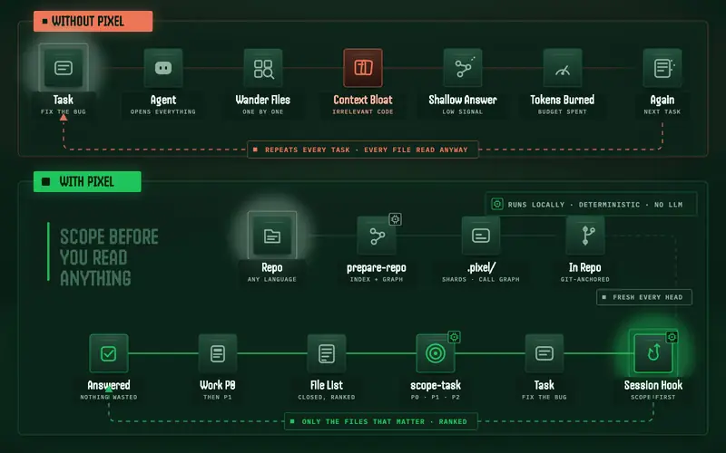
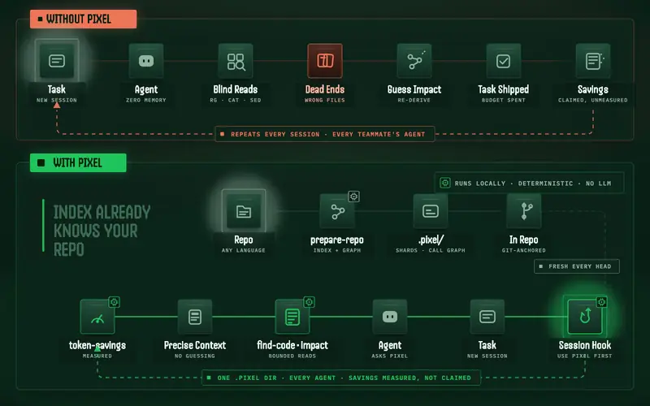
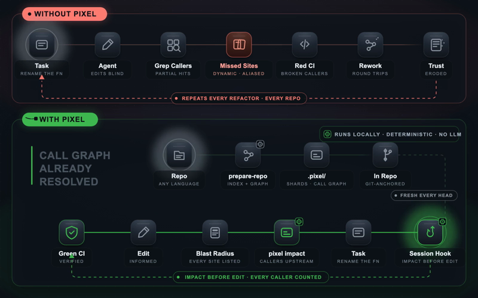
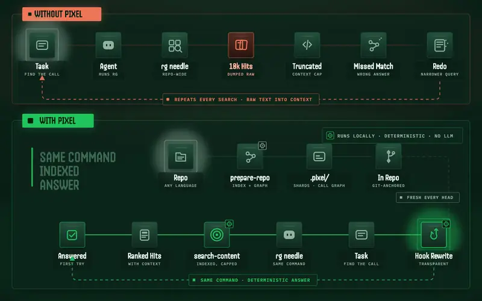
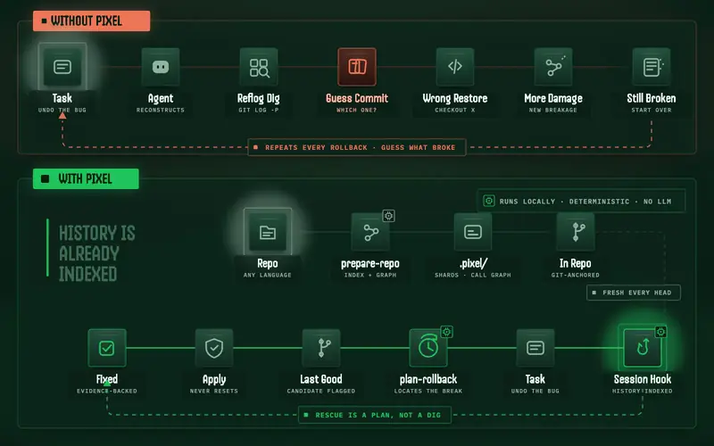
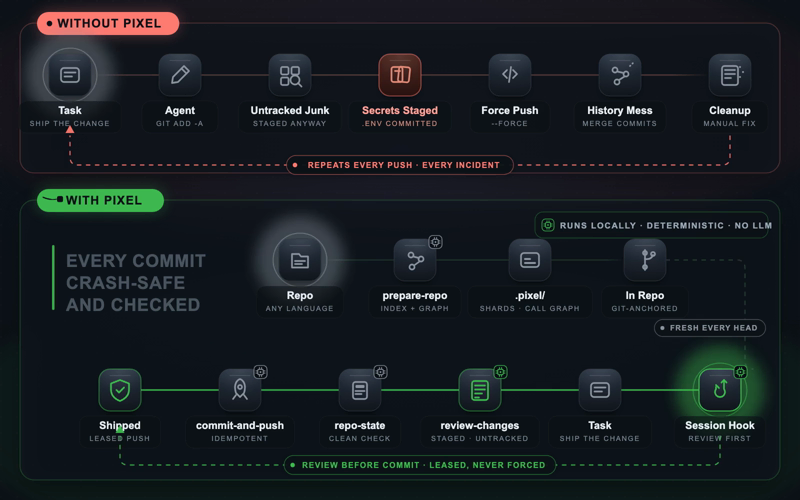

# 🟩 Pixel

> **A local control layer that helps coding agents spend less time on simple repository work.**

Pixel is not just a search box. It is the control layer for the whole path from a task to a safe Git change.

Pixel runs locally, connects repository structure with repository history, and returns evidence with boundaries. When it cannot prove that an answer is complete, it says so.

**Website and docs:** <https://liviogama.github.io/pixel/>

## 🎯 The goal

Make as much repository work deterministic as possible. If something can be answered or carried out from repository state, history, structure, or a proven flow, Pixel should do it directly—with evidence, clear boundaries, and safe recovery. Genuine ambiguity is where the agent should spend its time.

<p align="center">
  
</p>

## 💡 See the difference

Six jobs every coding agent does. Red rail: without Pixel. Blue rail: with it.
The `.pixel/` index is built once — every session, every agent reuses it.

### Scope before reading
`scope-task` returns a closed P0/P1/P2 file list instead of the agent wandering the repo.

<p align="center"></p>

### Retrieval that measures itself
Skeleton and context commands replace whole-file reads — and `token-savings` reports the real number, not a claimed one.

<p align="center"></p>

### Impact before edit
`pixel impact` lists every caller before the agent touches a symbol.

<p align="center"></p>

### Search stays transparent
`rg`/`grep` get rewritten to `search-content` by the hook — same command, indexed answer.

<p align="center"></p>

### Rescue as a plan
`plan-rollback` flags the likely-breaking commit and a last-known-good candidate — it never resets anything.

<p align="center"></p>

### Publish without footguns
`review-changes` → `repo-state` → leased `commit-and-push`: crash-safe, idempotent, never a raw `--force`.

<p align="center"></p>

## ⭐ The Pixel Flow

```text
task → scope-task → find-code → impact → edit → what-changed → review-changes → commit-and-push
```

## 📉 Token savings — measured, no second model

Spotify's [shunt](https://github.com/spotify/portal-ai-plugins/tree/main/plugins/shunt) plugin claims 82–94% savings by blocking large reads and rerouting them through a paid worker model (Portal/AiKA). Pixel gets the same effect **locally and deterministically** — `list-signatures`, `find-code`, `pack-context` answer "what's in this file" without any file contents or a second model entering the agent's context.

Replicating shunt's benchmark shape on this repo (138K lines, Rust), same methodology (UTF-8 bytes ÷ 4, what reaches the agent):

| Scenario | Lines | Full reads | With Pixel | Savings |
| --- | --- | --- | --- | --- |
| Single large file | 4,661 | 48,465 tok | 2,172 tok | 95.5% |
| Multi-file cross-read | 7,106 | 68,934 tok | 3,768 tok | 94.5% |
| Source + test pair | 5,289 | 48,978 tok | 1,890 tok | 96.1% |
| Code-write context | 5,289 | 48,978 tok | 1,910 tok | 96.1% |

Unlike shunt's headline number, Pixel also self-reports **measured** savings from real sessions via `pixel token-savings` — on this machine: **41–83%** across 798 recorded operations. Same caveat as every tool in this space: these numbers measure what the agent reads, not your invoice — verify against your own usage.

## 🚀 Start here

```bash
brew tap LivioGama/tap
brew install pixel
pixel prepare-repo .       # optional warm-up
pixel doctor .      # optional health check
pixel install       # let your agent use Pixel
```

`pixel install` is **global**: run it once, from anywhere. It deploys the
agent system prompt to `~/.local/share/pixel/` (`agent-prompt.md` + the short
`subagent-prompt.md`) and wires it into the agents it knows:

| Agent | How the prompt reaches it |
| --- | --- |
| Claude Code | `SessionStart`/`SubagentStart` lifecycle hooks in `~/.claude/settings.json` inject the prompt as context — no shell wrapper, never blocks |
| Codex | the `developer_instructions` key of `~/.codex/config.toml` (every front end gets it) + a metrics `PostToolUse` hook in `~/.codex/hooks.json` |
| Pi | `~/.pi/agent/APPEND_SYSTEM.md`, read automatically |
| OpenCode | the prompt appended to `AGENTS.md` |
| Antigravity | its plugin, hooks and configuration activated |

`pixel install --repo <path>` is the **per-project** variant: it writes
project-local enforcement only and skips all global steps —

- `<repo>/.claude/settings.local.json` — a pixel `run-hook guard --provider claude`
  `PreToolUse` group, in Claude Code's personal project settings (the shared
  `.claude/settings.json` never carries it); `<repo>/.claude/pixel-rtk-hooks.json`
  keeps an exact `rtk hook claude` group the guard takes over
- `<repo>/.codex/config.toml` — the same `developer_instructions` key
- `<repo>/.codex/hooks.json` — the composed-guard `PreToolUse` group, with
  `<repo>/.codex/pixel-composed-guard-backup.json` holding the hooks it
  replays; left alone when git tracks `.codex/hooks.json`
- `<repo>/.devin/config.local.json` — a pixel `run-hook guard --provider devin` hook
- `<repo>/.pi/extensions/pixel-guard.ts` — pi's guard extension, loaded once
  pi trusts the project, when pi starts from the repository root

Every one of those files except `.codex/config.toml` names this machine's
`pixel` binary, so the install lists it in the clone's `.git/info/exclude` and
a `git add -A` cannot publish it. pi gets its rules from the global install
(`~/.pi/agent/APPEND_SYSTEM.md`): a project `.pi/APPEND_SYSTEM.md` would
replace that file instead of adding to it.

The per-repo guard is advisory: it steers agents toward Pixel commands (e.g.
a soft notice before untargeted reads of large source files) without blocking
tool calls. `pixel doctor <repo>` reports both global wiring and per-repo
guards as green/stale/missing.

> [!NOTE]
> Any other agent (Cursor, Gemini CLI, Copilot, ...) is not wired by `pixel install` and will not know about Pixel on its own. Give it the same prompt through its own rules or system-prompt mechanism; see [Other agents and manual setup](#-other-agents-and-manual-setup).

| Need | Pixel command |
| --- | --- |
| Find text, a symbol, or a concept | `pixel search-content`, `pixel find-code`, `pixel search-meaning` |
| Scope work and see risk | `pixel scope-task`, `pixel impact`, `pixel what-changed` |
| Recover prior code or history | `pixel dig-history`, `pixel search-history`, `pixel plan-rollback` |
| Resolve a term the index cannot know | `pixel web-search` — deterministic fetch (SearXNG via `PIXEL_WEB_SEARCH_URL`, else DuckDuckGo/Wikipedia), no LLM |
| Review or safely publish | `pixel repo-state`, `pixel review-changes`, `pixel sync-branch`, `pixel commit` |

Pixel is local-first. Its index, graph, and optional history data live under `.pixel/`; it reports boundaries when results are capped, stale, or incomplete. Tests and code review remain necessary.

### ⬆️ Updating

Upgrading replaces the binary only. The agent prompt, shell wrapper and
per-agent config keys are written by `pixel install` into your home — they
are yours, not the package manager's — so they keep the old release's text
until you refresh them. `pixel doctor .` reports the wiring as missing or
stale until you do.

| Installed with | Upgrade the binary |
| --- | --- |
| Homebrew | `brew update && brew upgrade LivioGama/tap/pixel` |
| mise | `mise upgrade pixel` |
| `install.sh` | `curl -fsSL https://github.com/LivioGama/pixel/releases/latest/download/install.sh \| sh` |
| Source checkout | `pixel self-update` rebuilds and reinstalls the running binary; it refuses to write into a Homebrew Cellar or a mise install |

Then, whatever the channel, refresh the wiring and check it:

```bash
pixel install
pixel doctor .
```

### Plugin install (per-tool native)

This repo carries native plugin manifests, so each agent CLI can install Pixel's protocol through its own plugin mechanism — no `pixel install` step. The `pixel` binary still has to be installed (see above); the plugin never installs it. Always-on delivery is a SessionStart/SubagentStart hook (`hooks/pixel-context.sh`) that injects the protocol as `additionalContext` (the short sub-agent prompt for sub-agents) — context only, it never blocks a tool call. When `pixel` is missing from PATH, or too old for the command names the protocol uses, the hook injects a one-paragraph notice instead.

> [!NOTE]
> The commands below read the default branch `main`, which can be ahead of the latest release. When the installed `pixel` is too old for the command names the protocol uses, the hook injects its notice instead of the protocol: update the binary.

| Tool | Install |
| --- | --- |
| Claude Code | `/plugin marketplace add LivioGama/pixel` then `/plugin install pixel@pixel` |
| Codex | `codex plugin marketplace add LivioGama/pixel` then `codex plugin add pixel@pixel` |
| Copilot CLI | `copilot plugin marketplace add LivioGama/pixel` then `copilot plugin install pixel@pixel` |
| Devin | Add `github.com/LivioGama/pixel` as a Devin plugin — it picks up `.devin-plugin/` + `.cursor/rules/pixel.mdc` |
| Gemini CLI | `gemini extensions install https://github.com/LivioGama/pixel` |
| Pi | `pi install git:github.com/LivioGama/pixel` |
| OpenCode | `"plugin": ["@liviogama/pixel"]` in `opencode.json` (or `"./.opencode/plugins/pixel.mjs"` from a checkout) |
| Cursor / Windsurf / Kiro / Cline / Qoder | Rules ship under `.cursor/rules/`, `.windsurf/rules/`, `.kiro/steering/`, `.clinerules/`, `.qoder/rules/` — copy or vendor into your project |
| Anything else | `PIXEL.md` at the repo root is the plain-markdown protocol — paste it into whatever instruction surface the tool offers |

Generated surfaces (`skills/`, `PIXEL.md`, `PIXEL-SUBAGENT.md`, all rules files) come from the prompts in `crates/pixel-install/assets/` via `scripts/gen-plugin-assets.sh`; a test fails if they drift, and `pixel check-release` fails a release whose plugin manifests do not carry its version.

### 🔌 Other agents and manual setup

Using an agent the installer does not cover, or prefer to control your own setup? Deploy the agent
system prompt and wire it into your agent by hand — see
[Manual Setup](docs/manual-setup.md). The prompt itself lives at
[`crates/pixel-install/assets/pixel-agent-prompt.md`](crates/pixel-install/assets/pixel-agent-prompt.md)
(~275 lines / ~4 150 tokens) and is the single source of truth: every agent, installed or manual, should read that exact text.

> [!TIP]
> It's large because Pixel replaces a wide range of native commands (`grep`, `rg`, `git log -S`, `git blame`, manual caller tracing) with a single indexed workflow — and the token cost is recovered in as little as one `pixel impact` call.

For architecture and the full command surface, see [ARCHITECTURE.md](ARCHITECTURE.md) and `pixel --help`.
To build from source, run the gates, or open a pull request (with or without an AI agent), see [CONTRIBUTING.md](CONTRIBUTING.md).

Renamed commands: every subcommand got a verb-first name after 0.2.4; the
old names stay accepted as hidden aliases until 1.0. Full mapping in
[docs/renamed-commands.md](docs/renamed-commands.md).


## 🧠 Decision backends — measured vs Jev

`pixel classify` runs decisions through a remote LLM (the only backend —
`--remote-preset` picks OpenRouter, Ollama Cloud, or localhost). The
scores below are **coding decisions only** — the frozen coding subset of
JevBench (14 public coding-topic items, protocol in
[`docs/bench/decide-bakeoff.md`](docs/bench/decide-bakeoff.md)). These
Ollama Cloud models beat Jev's published coding score:

| Model | Coding score | vs Jev | p50/item | TPS² |
| --- | --- | --- | --- | --- |
| deepseek-v4.1-flash | **14/14 = 1.00** | ✅ | 1.4 s | 173 |
| deepseek-v4-flash | **13/14 = 0.93** | ✅ | 2.0 s | 77 |
| gpt-oss:120b | **13/14 = 0.93** | ✅ | 2.0 s | 176 |
| gpt-oss:20b | **13/14 = 0.93** | ✅ | 6.4 s | 99 |
| nemotron-3-ultra | **12/14 = 0.86** | ✅ | 8.1 s | 72 |
| **Jev** (reference) | **0.839**¹ | — | — | — |

¹ Jev's published coding-topic accuracy, n=56, all tiers — **published
number, not re-measured here**; different denominator than our n=14 subset.

² TPS from [ollamatps.com](https://ollamatps.com) (Ollama Cloud Pro),
fetched 2026-09-23.

No off-the-shelf local model (≤575 M) passed 0.50 on the same set.

## 📝 License

MIT. See [`NOTICE`](NOTICE) for attribution details.
