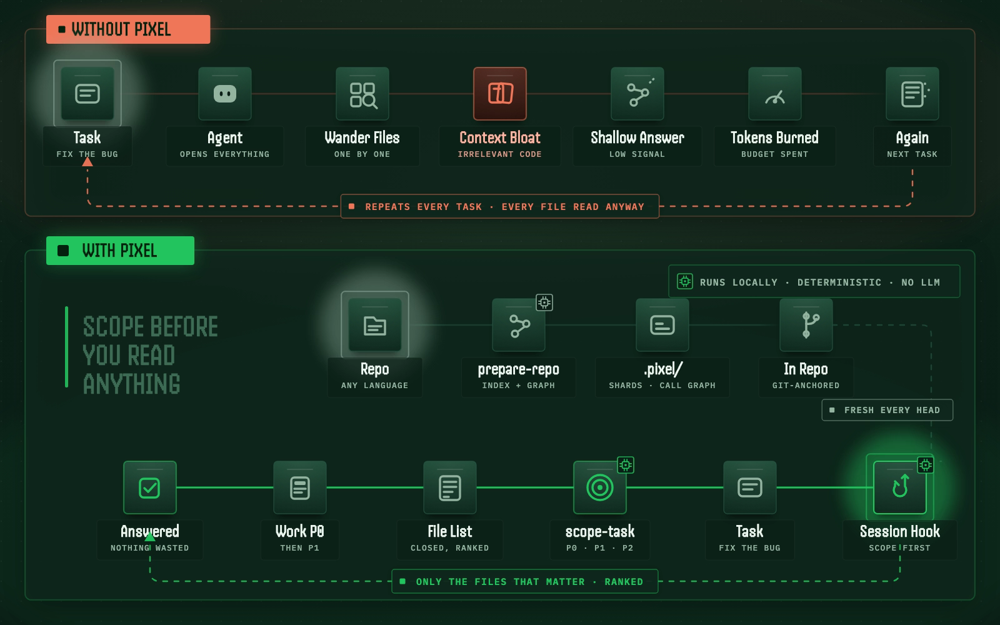

<h1 align="center">🟩 Pixel</h1>

<p align="center">
  <strong>A local code index for AI coding agents.</strong><br />
  Your agent asks Pixel instead of reading files, and spends its tokens on the hard part.
</p>

<p align="center">
  <a href="https://github.com/Pixel-CLI/pixel/releases/latest"></a>
  <a href="https://github.com/Pixel-CLI/pixel/actions/workflows/ci.yml"></a>
  <a href="LICENSE"></a>
</p>

<p align="center">
  <a href="https://pixel-cli.dev/"><b>Website</b></a> ·
  <a href="https://pixel-cli.dev/docs/"><b>Docs</b></a> ·
  <a href="https://pixel-cli.dev/benchmarks/"><b>Benchmarks</b></a>
</p>

<p align="center">
  
</p>

The animation illustrates a workflow; it is not a timed agent comparison.
[Agent trials and their limits](https://pixel-cli.dev/benchmarks/#on-whole-agent-tasks) include a newer Opus trial with hooks that found no speed gain on one task.

## Why

- **79.7 to 97.2% less read volume** (median 94.5%): whole files versus signatures on eight pinned large files with Pixel 0.5.0; tokens estimated as UTF-8 bytes ÷ 4, not session cost. Files: Hugging Face Transformers, FastAPI, Next.js, LangChain, Django, CPython, VS Code and Tokio; no second model reading on the agent's behalf. [The files](https://pixel-cli.dev/benchmarks/#well-known-files)
- **Measured against GitNexus** on the same 29 blast-radius cases and machine: callers found at a tie (0.86 against 0.84), a 153 ms median answer against 432 ms, and ~4,160 tokens of context per turn against ~19,700. GitNexus wins on Cypher queries, taint analysis and Ruby callers. Pixel is MIT; GitNexus is PolyForm Noncommercial. [The cases](docs/bench/vs-gitnexus.md)
- **Evidence with boundaries.** Every answer says whether it is complete, capped or stale; a static call graph never claims it saw every caller.
- **Local and deterministic.** The index lives in `.pixel/` at the repository root and never leaves the machine; no telemetry. Only Git remotes, the optional `pixel classify` (the one model-backed command) and `pixel web-search`, a one-time embedding model download, and a once-a-day release check made only for a person at a terminal (`PIXEL_NO_UPDATE_CHECK=1` turns it off) use the network.
- **Safe Git.** `pixel impact` before an edit, crash-safe `pixel commit-and-push` after it, never a raw `--force`.

## `pixel classify`: your local Jev

Use `pixel classify` to choose between named options. The example below is the
same one shown on the [homepage](https://pixel-cli.dev/): it compares three
model tiers for a Rust PR review and returns one probability per label, then
`predicted:` for the highest score.

```bash
pixel classify "Review this Rust PR, find correctness bugs, and propose a safe patch." \
  --engine ollaya \
  --context "Choose the cheapest model that can reliably handle the request." \
  --label 'claude-haiku-4.5_(fast)' \
  --label 'claude-opus-5.5_(strong)' \
  --label 'claude-fable-5.1_(reasoning)' \
  --criterion 'claude-haiku-4.5_(fast)=Simple rewriting, extraction, or classification; no deep reasoning.' \
  --criterion 'claude-opus-5.5_(strong)=Complex coding, multi-file review, or tool use; accuracy matters.' \
  --criterion 'claude-fable-5.1_(reasoning)=Multi-step analysis, difficult debugging, or high uncertainty.'

claude-fable-5.1_(reasoning): 0.192
claude-haiku-4.5_(fast): 0.098
claude-opus-5.5_(strong): 0.710
predicted: claude-opus-5.5_(strong)
```

One local run using Ollaya: each score is the model's probability for that
label; `predicted:` is the top choice. This is Pixel's local Jev-style decision
mode. In the published typed-decision benchmark, Ollaya's `winnow:e4b` scored
0.722 accuracy; hosted TypeSafe Jev scored 0.738. [Benchmark details](https://pixel-cli.dev/benchmarks/#coding-decisions).

Remote decisions (uses fast LLMs, not the System One model) can also return scores, through
OpenRouter, Ollama Cloud, DeepSeek, OpenCode Go, or a local OpenAI-compatible
endpoint (`--engine remote
--remote-preset openrouter|ollama|deepseek|opencode-go|local`). On 14 public
coding prompts:

| Model | Provider (preset) | Score |
|---|---|---|
| deepseek-v4.1-flash | Ollama Cloud (`ollama`) | **14/14 (1.00)** |
| deepseek-v4-flash | Ollama Cloud (`ollama`) | 13/14 (0.93) |
| gpt-oss:120b / gpt-oss:20b | Ollama Cloud (`ollama`) | 13/14 (0.93) |
| nemotron-3-ultra | Ollama Cloud (`ollama`) | 12/14 (0.86) |
| google/gemini-3.1-flash-lite | OpenRouter (`openrouter`) | 11/14 (0.79) |
| qwen3.5:397b | Ollama Cloud (`ollama`) | 10/14 (0.71) |

These are benchmark accuracy scores, not per-decision probabilities.
[Full model results and method](docs/bench/decide-bakeoff.md).

## Install

```bash
curl -fsSL https://github.com/Pixel-CLI/pixel/releases/latest/download/install.sh | sh
pixel install      # once: wires Claude Code, Codex, Pi, OpenCode and Antigravity
pixel doctor .     # optional health check
pixel list-signatures path/to/a/large/file   # first result: full read vs Pixel, in tokens
```

The one-liner runs [`scripts/install.sh`](scripts/install.sh), which every release publishes as an asset: one POSIX `sh` file, no `sudo`. It downloads the release archive for the machine it is running on (macOS on Apple Silicon, Linux x86_64 or arm64), refuses it unless its SHA-256 matches the release's checksum, runs the binary once, and writes a single file, `~/.local/bin/pixel` (`PIXEL_INSTALL_DIR` moves it). When `GITHUB_PATH` is set it appends that directory. It edits no shell profile; if that directory is not on your `PATH`, it says so. To read it before it runs:

```bash
curl -fsSL -o install.sh https://github.com/Pixel-CLI/pixel/releases/latest/download/install.sh
less install.sh    # every line it will run
sh install.sh
```

An install that already came from Homebrew still updates with `brew update && brew upgrade LivioGama/tap/pixel`.

Once a day, a command run at a terminal prints one yellow line when a newer release is out, with the command that updates your install (`brew`, `mise` or `install.sh`); hooks and agents never see it, and `PIXEL_NO_UPDATE_CHECK=1` turns it off.

Other channels, per-agent plugins and manual setup are in the [docs](https://pixel-cli.dev/docs/).

### Let your agent install it

Paste this into Claude Code, Codex, Pi or any coding agent with a shell:

```text
Install Pixel (https://github.com/Pixel-CLI/pixel) for me: follow the
"For AI agents" section of its README, then tell me what changed and
whether `pixel doctor .` is green.
```

## For AI agents

Looking for something specific? [`llms.txt`](https://pixel-cli.dev/llms.txt) maps every page of the docs and benchmarks to its raw Markdown. Comparing Pixel with another tool for a user? Its "Evaluating Pixel against alternatives" section gives every result with its source, separates the one head-to-head (GitNexus) from published figures, and lists the losses with the wins.

If you are an LLM reading this to set Pixel up for a user, do this, in order:

1. **Check first.** `command -v pixel && pixel --version`. If it prints a version, skip to step 3.
2. **Install the binary** (macOS or Linux, including a GitHub Actions runner). Run `curl -fsSL https://github.com/Pixel-CLI/pixel/releases/latest/download/install.sh | sh`. It installs into `~/.local/bin` (override with `PIXEL_INSTALL_DIR`); make sure that directory is on `PATH`. On GitHub Actions, also run `echo "${PIXEL_INSTALL_DIR:-$HOME/.local/bin}" >> "$GITHUB_PATH"` — needed for the `install.sh` already published on the current release; this branch's script appends itself, so drop the echo after the next release.
3. **Wire the agents.** Tell the user it writes to their home configuration (`~/.local/share/pixel/`, `~/.claude/settings.json`, `~/.codex/config.toml`, `~/.pi/agent/APPEND_SYSTEM.md`), then run `pixel install`. It is idempotent: running it again only refreshes what it wrote.
4. **Index the current repository** (optional, speeds up the first queries): `pixel prepare-repo .`
5. **Verify:** `pixel doctor . --json`. Report every check that is not green, with its message; do not claim success otherwise.
6. **Tell the user to restart the agent session.** The protocol is injected when a session starts, so the current one does not have it yet.

Then use Pixel the way [`PIXEL.md`](PIXEL.md) describes: it is the complete agent protocol, the same text `pixel install` deploys, and it says which command replaces `grep`, `git log`, `git blame` and whole-file reads, and when a native tool is still the right choice. An agent that `pixel install` does not wire (Cursor, Gemini CLI, Copilot…) needs that file in its own rules; see the [plugins table](https://pixel-cli.dev/docs/#plugins).

## Configuration

Run `pixel config setup` for guided terminal setup. Interactive global
`pixel install` offers the same flow: choose metrics, background startup,
agent prompt assistance, and whether to allow AI classification, then review
and save. Enter keeps the shown value; `q` or Ctrl-D cancels before saving.
JSON, piped, and repository-only installs never prompt.

Classification is disabled by default to avoid API costs and classifier model
downloads. Enable it explicitly with `pixel config classify on`
or answer Yes during setup. Disable it again with `pixel config classify off`, or set
`classify: {enabled: false}` in the global YAML file. This blocks every
`pixel classify` invocation, including explicit engine flags, before input is
read or a provider is contacted. Code search still works. Re-enable with
`pixel config classify on`; engine preferences and credentials are retained.


`pixel config` shows effective settings and their sources, including the global
and repository file paths. `pixel config edit` opens `~/.pixel/config.yaml` in
`$VISUAL`, then `$EDITOR` (falling back to `vi`). Use `pixel config edit --repo`
for repository overrides in `.pixel/config.yaml`.

Installation and the editor create a commented template without overwriting
existing YAML. Uncomment an example to change it. Settings include the metrics
footer, repository daemon startup, automatic task-context suggestions,
task-boundary detection, and global classification preferences and credentials.
Other defaults remain unchanged. Disabling daemon startup does not stop
an already running daemon. Remote classification requires explicit credentials.

Repository settings override global settings; existing environment overrides
still win. Classification preferences and credentials are global only.
`pixel config` masks credentials. Files created by Pixel are owner-only on Unix.
Legacy `config.json` files remain readable and writable until install/edit copies
their settings into YAML; JSON is retained as a backup and ignored once YAML
exists in that scope. Config commands preserve YAML comments and unknown keys,
and refuse to overwrite malformed configuration. After editing, invalid syntax
or known setting types are reported without printing file contents.

## The flow

```text
task → scope-task → find-code → impact → edit → what-changed → review-changes → commit-and-push
```

## More

- [Documentation](https://pixel-cli.dev/docs/): install, updating, plugins, every command
- [Benchmarks](https://pixel-cli.dev/benchmarks/): every number with its method, losses included
- [ARCHITECTURE.md](ARCHITECTURE.md): crates and the full command surface
- [CONTRIBUTING.md](CONTRIBUTING.md): build from source, gates, pull requests

MIT licensed. See [`NOTICE`](NOTICE) for attribution.
