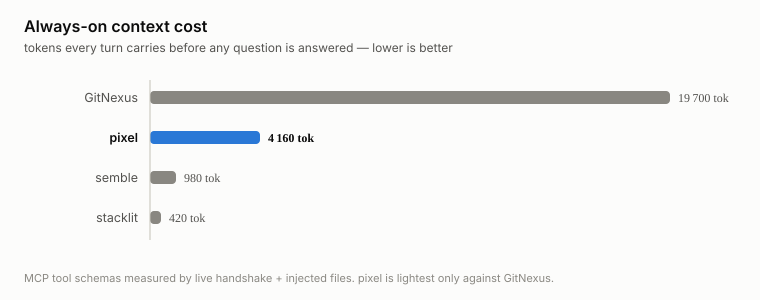
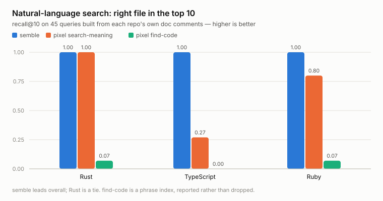
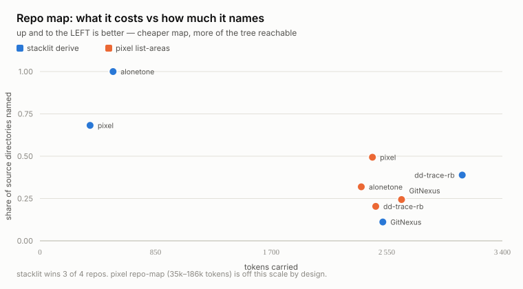

# pixel among the agent-retrieval tools — measured

Companion to [`vs-gitnexus.md`](vs-gitnexus.md), which covers the graph
capabilities. This page covers the two tools that solve *different* problems:
[semble](https://github.com/MinishLab/semble) (semantic code search) and
[stacklit](https://github.com/glincker/stacklit) (a static repo map for agents).

Measured 2026-09-21 on an Apple M2 / 16 GiB. Versions, corpus commits and the
contamination control: [`vs-tools/raw/environment.txt`](vs-tools/raw/environment.txt).
Same house rule as the rest of `docs/bench/`: losses in the same voice as wins.

**The short version: pixel loses both of these head-to-heads.** semble retrieves
better than either of pixel's search engines, and stacklit produces a far cheaper
orientation map than `pixel list-areas`. Both losses are reproducible with the
committed scripts.

## These three tools are not substitutes

| | GitNexus | semble | stacklit | pixel |
|---|---|---|---|---|
| Call graph / impact | yes | — | **explicitly no** | yes |
| Semantic search | via `query` (flows) | **yes, its whole purpose** | — | `search-meaning` |
| Static repo map | — | — | **yes, its whole purpose** | `repo-map`, `list-areas` |
| Git history archaeology | — | — | git activity only | yes |
| Repo operations (commit/push/branch) | — | — | — | yes |
| Language | TypeScript | Python | Go | Rust |
| Licence | PolyForm Noncommercial | MIT | MIT | MIT |

stacklit's own README states it does not answer queries and has no impact
analysis or call graphs, so only its map is benchmarked. semble has no graph, so
only its search is. Scoring either on the other's ground would measure nothing.

## Context tax — what each costs before answering anything

Measured by driving a real stdio MCP handshake and serialising the `tools/list`
result ([`mcp-schema-size.py`](../../scripts/bench-vs/mcp-schema-size.py)), plus
the installed/injected files. Tokens are bytes/4.

| Tool | MCP tools | Schema bytes | Injected always-on | ≈ total tokens |
|---|---|---|---|---|
| GitNexus | 17 | 75 202 | 3 727 (`CLAUDE.md` block) | **~19 700** |
| pixel | — (CLI) | — | 16 631 (agent prompt) | **~4 160** |
| semble | 2 | 3 928 | sub-agent file, description only | **~980** |
| stacklit | 7 | 1 687 | derived map, see below | **~420** + map |

<picture>
  <source media="(prefers-color-scheme: dark)" srcset="charts/context-tax-dark.svg">
  
</picture>

**This is a loss for pixel and it invalidates a claim.** Against GitNexus,
pixel's 4.7× lighter context is a real advantage; against semble and stacklit it
is 4× and 10× *heavier*. Any statement that pixel is "the light one" is only
true relative to GitNexus, and the user-facing page says so.

The shape of the cost differs and matters: semble's and stacklit's budgets are
MCP tool schemas, which a user can drop by unregistering the server. pixel's is
doctrine text, which is what makes its CLI usable without any schemas at all.
Neither figure includes what an answer costs — measured below.

## Natural-language retrieval — semble vs pixel, 45 queries

Queries are the repositories' **own doc comments**, with every word of the
documented symbol's identifier and of the file's basename stripped out, so the
task cannot be solved by lexical name matching
([`gen-queries.py`](../../scripts/bench-vs/gen-queries.py)). The relevant
document is the file that comment documents. This is CodeSearchNet's design: the
maintainers wrote the queries, not the benchmark author, and not a tool under
test. 15 queries per corpus, median of 3 reps after a discarded warm-up.

`gitnexus query` is absent: it returns execution flows, not a ranked file list.

| Corpus | Arm | n | r@1 | r@5 | r@10 | p50 | bytes |
|---|---|---|---|---|---|---|---|
| Rust (pixel) | semble | 15 | **0.73** | **1.00** | **1.00** | **650 ms** | 7 853 |
| | pixel `search-meaning` | 15 | 0.67 | 0.87 | 0.87 | 1 045 ms | **2 254** |
| | pixel `find-code` | 15 | 0.00 | 0.00 | 0.00 | 218 ms | 3 141 |
| TypeScript (GitNexus) | semble | 15 | **0.27** | **0.93** | **1.00** | 3 000 ms | 9 047 |
| | pixel `search-meaning` | 15 | 0.13 | 0.20 | 0.20 | 5 614 ms | **2 400** |
| | pixel `find-code` | 15 | 0.00 | 0.00 | 0.00 | **474 ms** | 2 755 |
| Ruby (dd-trace-rb) | semble | 15 | 0.60 | **0.80** | **0.93** | 1 257 ms | 7 873 |
| | pixel `search-meaning` | 15 | 0.60 | 0.73 | 0.73 | 2 320 ms | **2 382** |
| | pixel `find-code` | 15 | 0.00 | 0.00 | 0.00 | 240 ms | 15 657 |
| **All** | **semble** | **45** | **0.53** | **0.91** | **0.98** | 1 636 ms | 8 257 |
| | **pixel `search-meaning`** | **45** | 0.47 | 0.60 | 0.60 | 2 993 ms | **2 345** |
| | **pixel `find-code`** | **45** | 0.00 | 0.00 | 0.00 | **311 ms** | 7 184 |

<picture>
  <source media="(prefers-color-scheme: dark)" srcset="charts/retrieval-recall-dark.svg">
  
</picture>

Readings:

- **semble wins, clearly and on every corpus.** r@10 0.98 vs 0.60 is not a
  margin that more reps would close. It is a purpose-built retrieval model doing
  the job it was built for, against a general tool's secondary engine.
- **pixel's TypeScript result is the bad one**: r@10 of 0.20. On the same corpus
  where its *graph* answers every blast-radius query completely
  ([vs-gitnexus.md](vs-gitnexus.md)), its semantic search finds the right file
  one time in five.
- **semble is also faster** end to end (1 636 ms vs 2 993 ms p50), despite being
  Python against a Rust binary.
- **pixel's one win is answer size**: 2 345 bytes vs 8 257, 3.5× smaller, on
  every corpus. `pixel token-savings` exists in part as a counter to semble's
  "99% fewer tokens" claim; on *bytes per answer* that counter holds. On
  *whether the answer contains the file you wanted*, it does not.
- **`find-code` scores 0.00 everywhere, and that is the wrong question for it.**
  It is a concept/phrase index built for strings that occur in code, not prose
  descriptions. It is reported anyway: reporting only `search-meaning` would be
  picking pixel's better engine per query, which is the selective quoting this
  whole exercise exists to avoid. Its parser was verified working (it returned
  1–8 files per case, just never the right one), so 0.00 is a result, not a bug.
- One query out of 45 was answered by no arm
  (`lib/datadog/tracing/sampling/matcher.rb`, "Returns true the trace should
  conforms this rule") — a doc comment too generic to identify its file.

## Repo map — stacklit vs pixel, 4 repos

Two axes, reported side by side and never collapsed: what the map costs, and how
much of the tree it lets an agent find. Coverage is the share of tracked source
files named by path, and the share whose *directory* is named — a module-level
map navigates by directory ([`bench-map.py`](../../scripts/bench-vs/bench-map.py)).

| Repo | Artifact | Tokens | file-cov | dir-cov |
|---|---|---|---|---|
| pixel (239 src) | `stacklit derive` | **369** | 0.008 | **0.682** |
| | `pixel list-areas` | 2 445 | 0.000 | 0.494 |
| | `pixel repo-map --markdown` | 91 799 | 1.000 | 1.000 |
| alonetone (448) | `stacklit derive` | **538** | 0.000 | **1.000** |
| | `pixel list-areas` | 2 363 | 0.000 | 0.319 |
| | `pixel repo-map --markdown` | 35 160 | 1.000 | 1.000 |
| dd-trace-rb (2 072) | `stacklit derive` | 3 105 | 0.001 | **0.389** |
| | `pixel list-areas` | **2 469** | 0.000 | 0.204 |
| | `pixel repo-map --markdown` | 186 221 | 0.926 | 0.951 |
| GitNexus (3 808) | `stacklit derive` | 2 521 | 0.000 | 0.111 |
| | `pixel list-areas` | 2 659 | 0.000 | **0.244** |
| | `pixel repo-map --markdown` | 179 676 | 0.457 | 0.460 |

<picture>
  <source media="(prefers-color-scheme: dark)" srcset="charts/map-cost-coverage-dark.svg">
  
</picture>

- **stacklit beats `pixel list-areas` on 3 of 4 repos**, and on the two small
  ones it is not close: 369 tokens for 68 % directory coverage against 2 445
  tokens for 49 %. pixel wins only on GitNexus (0.244 vs 0.111).
- **stacklit's "~250 tokens" claim holds only on small repos.** 369 and 538 are
  near it; dd-trace-rb and GitNexus produce 3 105 and 2 521 — an order of
  magnitude above the headline, and in the same range as `list-areas`. Stated as
  an observation about scaling, not a criticism of the tool.
- **`pixel repo-map` is not in this contest.** At 35k–186k tokens it is a full
  index dump, not something an agent carries. It is listed to show what the
  coverage ceiling costs.

## A pixel defect this benchmark uncovered

**pixel does not honour `.git/info/exclude`.** The first retrieval run had
`pixel search-meaning` returning `stacklit.json` and `.gitnexus/gitnexus.json`
— the benchmark's own artifacts — among its top hits, because the patterns had
been added to `.git/info/exclude` (which git honours) rather than `.gitignore`
(which pixel honours). Every measurement above was re-run after moving the
patterns to `.gitignore` and rebuilding all four indexes; verified zero artifact
hits before recording.

Two separate things follow: the numbers here are clean, and pixel has a real bug
— a repo-local exclude that git respects is invisible to the indexer, so
generated files land in search results. Worth fixing independently of this page.

## Not measured

- Agent-level task time for any tool.
- semble's `find_related`; stacklit's `get_hints`, `get_hot_files`,
  `get_dependencies` and its HTML/Mermaid views.
- Index build time and footprint for semble and stacklit.
- Whether an agent given only stacklit's map can actually complete a task — the
  coverage proxy measures what the map *names*, not what it *enables*.
- n is 15 per corpus and one machine, one day.

Figures on this page are generated by
[`make-charts.py`](../../scripts/bench-vs/make-charts.py) directly from the raw
rows below, so a chart cannot drift from the measurement it illustrates.

## Raw data

- [`vs-tools/raw/summary-retrieval.txt`](vs-tools/raw/summary-retrieval.txt), [`summary-map.txt`](vs-tools/raw/summary-map.txt)
- [`vs-tools/raw/`](vs-tools/raw/) — every case, every rep
- [`vs-tools/cases/`](vs-tools/cases/) — the query sets, regenerable
- [`vs-tools/raw/environment.txt`](vs-tools/raw/environment.txt) — versions, commits, contamination control
