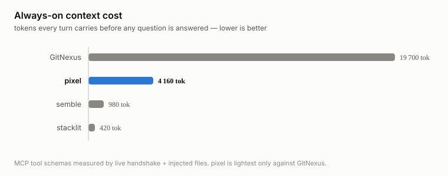
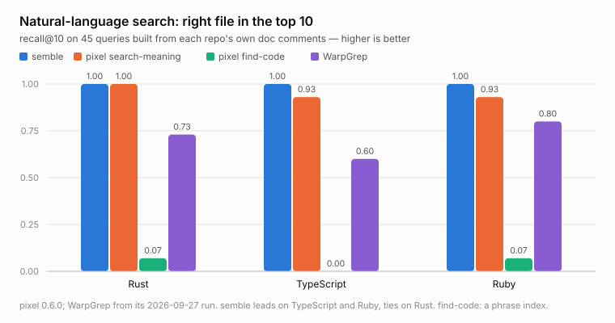
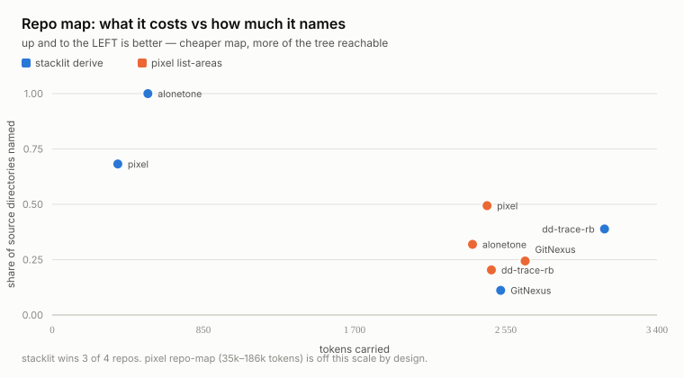

# pixel among the agent-retrieval tools — measured

Companion to [`vs-gitnexus.md`](vs-gitnexus.md), which covers the graph
capabilities. This page covers the two tools that solve *different* problems:
[semble](https://github.com/MinishLab/semble) (semantic code search) and
[stacklit](https://github.com/glincker/stacklit) (a static repo map for agents),
plus a later retrieval run that adds [WarpGrep](https://www.morphllm.com/products/warpgrep)
(an RL-trained search subagent).

Measured 2026-09-21 on an Apple M2 / 16 GiB. Versions, corpus commits and the
contamination control: [`vs-tools/raw/environment.txt`](vs-tools/raw/environment.txt).
The natural-language retrieval section was re-measured on 2026-09-27 on pixel
0.6.0 ([`vs-tools/raw/v0.6.0/environment.txt`](vs-tools/raw/v0.6.0/environment.txt)).
Same house rule as the rest of `docs/bench/`: losses in the same voice as wins.

**The short version.** On the 45 doc-comment queries, pixel 0.6.0's
`search-meaning` puts the right file first more often than any other arm
(r@1 0.87, against WarpGrep 0.69 and semble 0.64) and answers in 0.7 s on average against
semble's 1.6 s and WarpGrep's 6.8 s. semble still leads the top-10 list
(r@10 1.00 against 0.96: one TypeScript and one Ruby file it finds and pixel does
not) and costs about a quarter of pixel's context per turn. The queries are the
code's own doc comments, which favours a tool that keeps a comment and its
symbol in one chunk, as pixel 0.6.0 does (see the caveat under the table).
stacklit still produces a far cheaper orientation map than `pixel list-areas`:
that loss stands. Every figure is reproducible with the committed scripts.

## These three tools are not substitutes

| | GitNexus | semble | stacklit | pixel |
|---|---|---|---|---|
| Call graph / impact | yes | — | **explicitly no** | yes |
| Semantic search | via `query` (flows) | **yes, its whole purpose** | — | `search-meaning` |
| Static repo map | — | — | **yes, its whole purpose** | `repo-map`, `list-areas` |
| Git history archaeology | — | — | git activity only | yes |
| Repo operations (commit/push/branch) | — | — | — | yes |
| Language | TypeScript | Python | Go | Rust |
| Licence | PolyForm Noncommercial | MIT | MIT | MIT |

stacklit's own README states it does not answer queries and has no impact
analysis or call graphs, so only its map is benchmarked. semble has no graph, so
only its search is. Scoring either on the other's ground would measure nothing.

## Context tax — what each costs before answering anything

Measured by driving a real stdio MCP handshake and serialising the `tools/list`
result ([`mcp-schema-size.py`](../../scripts/bench-vs/mcp-schema-size.py)), plus
the installed/injected files. Tokens are bytes/4.

| Tool | MCP tools | Schema bytes | Injected always-on | ≈ total tokens |
|---|---|---|---|---|
| GitNexus | 17 | 75 202 | 3 727 (`CLAUDE.md` block) | **~19 700** |
| pixel | — (CLI) | — | 16 631 (agent prompt) | **~4 160** |
| semble | 2 | 3 928 | sub-agent file, description only | **~980** |
| stacklit | 7 | 1 687 | derived map, see below | **~420** + map |

<picture>
  <source media="(prefers-color-scheme: dark)" srcset="charts/context-tax-dark.svg">
  
</picture>

**This is a loss for pixel and it invalidates a claim.** Against GitNexus,
pixel's 4.7× lighter context is a real advantage; against semble and stacklit it
is 4× and 10× *heavier*. Any statement that pixel is "the light one" is only
true relative to GitNexus, and the user-facing page says so.

The shape of the cost differs and matters: semble's and stacklit's budgets are
MCP tool schemas, which a user can drop by unregistering the server. pixel's is
doctrine text, which is what makes its CLI usable without any schemas at all.
Neither figure includes what an answer costs — measured below.

## Natural-language retrieval — pixel 0.6.0, four arms, 45 queries

Queries are the repositories' **own doc comments**, with every word of the
documented symbol's identifier and of the file's basename stripped out, so the
task cannot be solved by lexical name matching
([`gen-queries.py`](../../scripts/bench-vs/gen-queries.py)). The relevant
document is the file that comment documents: CodeSearchNet's design, where the
maintainers wrote the queries, not the benchmark author or a tool under test.
15 queries per corpus, median of 3 reps after a discarded warm-up.

semble and both pixel engines were re-run on 2026-09-27 on pixel 0.6.0
(`3ff58da`, the commit `v0.6.0` points to), same corpus commits and query sets.
**WarpGrep was not re-run**: each search is a paid call, so its rows are its
2026-09-27 run on the same queries and corpora
([below](#natural-language-retrieval--warpgrep-joins-pixel-052-45-queries)).
Command, versions and load: [`v0.6.0/environment.txt`](vs-tools/raw/v0.6.0/environment.txt).

```sh
PATH=$PWD/target/dev-release:$PATH python3 scripts/bench-vs/bench-retrieval.py \
  <repo> docs/bench/vs-tools/cases/queries-<lang>.json "$(command -v semble)"
python3 scripts/bench-vs/summarize-retrieval.py docs/bench/vs-tools/raw/v0.6.0/retrieval-*.json
```

| Corpus | Arm | r@1 | r@5 | r@10 | p50 | bytes | files |
|---|---|---|---|---|---|---|---|
| Rust (pixel) | semble | 0.67 | **1.00** | **1.00** | 543 ms | 7 919 | 9.3 |
| | pixel `search-meaning` | **1.00** | **1.00** | **1.00** | 254 ms | **2 528** | 10.0 |
| | pixel `find-code` | 0.00 | 0.07 | 0.07 | **40 ms** | 3 445 | 3.3 |
| | WarpGrep (09-27 run) | 0.73 | 0.73 | 0.73 | 7 598 ms | 8 527 | 1.0 |
| TypeScript (GitNexus) | semble | **0.73** | **1.00** | **1.00** | 2 828 ms | 10 730 | 9.5 |
| | pixel `search-meaning` | **0.73** | 0.93 | 0.93 | 1 174 ms | **2 793** | 10.0 |
| | pixel `find-code` | 0.00 | 0.00 | 0.00 | **130 ms** | 2 826 | 4.5 |
| | WarpGrep (09-27 run) | 0.53 | 0.60 | 0.60 | 6 985 ms | 7 979 | 1.3 |
| Ruby (dd-trace-rb) | semble | 0.53 | 0.87 | **1.00** | 1 417 ms | 7 788 | 9.9 |
| | pixel `search-meaning` | **0.87** | **0.93** | 0.93 | 608 ms | **2 636** | 10.0 |
| | pixel `find-code` | 0.07 | 0.07 | 0.07 | **67 ms** | 23 973 | 7.1 |
| | WarpGrep (09-27 run) | 0.80 | 0.80 | 0.80 | 5 932 ms | 9 720 | 1.3 |
| **All** | **semble** | 0.64 | **0.96** | **1.00** | 1 596 ms | 8 812 | 9.6 |
| | **pixel `search-meaning`** | **0.87** | **0.96** | 0.96 | 678 ms | **2 652** | 10.0 |
| | **pixel `find-code`** | 0.02 | 0.04 | 0.04 | **79 ms** | 10 081 | 5.0 |
| | **WarpGrep (09-27 run)** | 0.69 | 0.71 | 0.71 | 6 838 ms | 8 742 | 1.2 |

**Read this table with its bias.** Every query is the target symbol's own doc
comment, and pixel 0.6.0 cuts its search chunks along symbols *with* their doc
comments ([#330](https://github.com/Pixel-CLI/pixel/pull/330)): the comment the
query was made from sits in the chunk it has to find. Measured on #330,
detaching comments from their symbols scores higher on this set and lower on the
hand-labelled `ndcg_relevance` qrels. Read these figures as "finds the code a
description was written for", not as general question answering.

p50 is the mean over cases of each case's median. It is load-sensitive: the
same code measured on #330 gave 538 ms for `search-meaning`, this run 678 ms on
a machine with a load average of 7 to 9; the arms of one run are interleaved,
so their ratio holds, the absolute value moves about 25 %. Bytes are the ranked
list with paths and snippets (for WarpGrep, the code it hands the agent);
`files` is how many distinct files the answer names.

<picture>
  <source media="(prefers-color-scheme: dark)" srcset="charts/retrieval-recall-dark.svg">
  
</picture>

Readings:

- **pixel now leads the first answer.** r@1 0.87 against WarpGrep's 0.69 and
  semble's 0.64, ahead or level on every corpus: 1.00 on Rust, level with
  semble on TypeScript (0.73), 0.87 on Ruby against WarpGrep's 0.80.
- **semble still leads the list.** r@10 1.00 against 0.96: it has every file
  in its top 10, pixel misses two, one per corpus
  (`frameworks/spring/di-metadata.ts` and `contrib/sidekiq/utils.rb`), both of
  which semble ranks first.
- **pixel is the fastest semantic arm** in this run: 678 ms p50 against 1 596 ms
  for semble (2.4×) and 6 838 ms for WarpGrep. `find-code` is faster still and
  answers the wrong question (below).
- **Answers stay the smallest:** 2 652 bytes against 8 812 for semble (3.3×).
  pixel 0.6.0 returns ten files instead of eight, and its answers grew by about
  a quarter over 0.5.2 (2 150 bytes).
- **WarpGrep names one file**, so its r@10 barely moves above its r@1; it is
  also not deterministic (2 of 19 cases flipped between two runs), and its
  rows here are from pixel 0.5.2's run, not re-measured.
- **`find-code` scores 0.04, and that is the wrong question for it.** It is a
  concept/phrase index built for strings that occur in code, not prose
  descriptions. It is reported anyway: reporting only `search-meaning` would be
  picking pixel's better engine per query.

**What changed since 0.5.2** (r@1 0.47, r@10 0.69 in the runs below): #326 to
#330 rebuilt `search-meaning`: the gitignore-aware file universe and ten hits
instead of eight ([#326](https://github.com/Pixel-CLI/pixel/pull/326)), chunk vectors persisted
in `.pixel/code-vectors` ([#327](https://github.com/Pixel-CLI/pixel/pull/327)),
every eligible file searched by default
([#328](https://github.com/Pixel-CLI/pixel/pull/328)), the lexical channel ranked by
BM25, with tests, config and docs weighted below code
([#329](https://github.com/Pixel-CLI/pixel/pull/329)), and chunks cut along
tree-sitter symbols with their doc comments
([#330](https://github.com/Pixel-CLI/pixel/pull/330)). semble's figures
reproduce the earlier runs exactly.

## Natural-language retrieval — semble vs pixel 0.4.0, 45 queries (2026-09-21, history)

Superseded by the pixel 0.6.0 table above; kept as recorded. Queries are the repositories' **own doc comments**, with every word of the
documented symbol's identifier and of the file's basename stripped out, so the
task cannot be solved by lexical name matching
([`gen-queries.py`](../../scripts/bench-vs/gen-queries.py)). The relevant
document is the file that comment documents. This is CodeSearchNet's design: the
maintainers wrote the queries, not the benchmark author, and not a tool under
test. 15 queries per corpus, median of 3 reps after a discarded warm-up.

`gitnexus query` is absent: it returns execution flows, not a ranked file list.

| Corpus | Arm | n | r@1 | r@5 | r@10 | p50 | bytes |
|---|---|---|---|---|---|---|---|
| Rust (pixel) | semble | 15 | 0.67 | **1.00** | **1.00** | **606 ms** | 8 009 |
| | pixel `search-meaning` | 15 | **0.87** | **1.00** | **1.00** | 1 019 ms | **2 231** |
| | pixel `find-code` | 15 | 0.00 | 0.07 | 0.07 | 225 ms | 3 353 |
| TypeScript (GitNexus) | semble | 15 | **0.73** | **1.00** | **1.00** | 3 046 ms | 10 730 |
| | pixel `search-meaning` | 15 | 0.20 | 0.20 | 0.27 | 5 413 ms | **2 439** |
| | pixel `find-code` | 15 | 0.00 | 0.00 | 0.00 | **592 ms** | 2 826 |
| Ruby (dd-trace-rb) | semble | 15 | **0.53** | **0.87** | **1.00** | 1 410 ms | 7 788 |
| | pixel `search-meaning` | 15 | 0.33 | 0.80 | 0.80 | 2 390 ms | **2 392** |
| | pixel `find-code` | 15 | 0.00 | 0.07 | 0.07 | 270 ms | 27 919 |
| **All** | **semble** | **45** | **0.64** | **0.96** | **1.00** | 1 688 ms | 8 842 |
| | **pixel `search-meaning`** | **45** | 0.47 | 0.67 | 0.69 | 2 941 ms | **2 354** |
| | **pixel `find-code`** | **45** | 0.00 | 0.04 | 0.04 | **362 ms** | 11 366 |

Readings, as of that run:

- **semble wins overall, but not everywhere.** r@10 1.00 against 0.69 across the
  45 queries. It is a purpose-built retrieval model doing the job it was built
  for, against a general tool's secondary engine, and the aggregate says so.
- **On Rust the two are level, and pixel ranks better.** Both reach r@10 1.00,
  and `search-meaning` puts the right file **first** more often than semble does
  (r@1 0.87 vs 0.67). Whatever is wrong below is not wrong everywhere.
- **pixel's TypeScript result is the bad one**: r@10 of 0.27 against semble's
  1.00. On the same corpus where its *graph* answers every blast-radius query
  completely ([vs-gitnexus.md](vs-gitnexus.md)), its semantic search finds the
  right file roughly one time in four.
- **semble is also faster** end to end (1 688 ms vs 2 941 ms p50), despite being
  Python against a Rust binary.
- **pixel's one win is answer size**: 2 354 bytes vs 8 842, 3.8× smaller, on
  every corpus. `pixel token-savings` exists in part as a counter to semble's
  "99% fewer tokens" claim; on *bytes per answer* that counter holds. On
  *whether the answer contains the file you wanted*, it does not.
- **`find-code` scores 0.04, and that is the wrong question for it.** It is a
  concept/phrase index built for strings that occur in code, not prose
  descriptions. It is reported anyway: reporting only `search-meaning` would be
  picking pixel's better engine per query, which is the selective quoting this
  whole exercise exists to avoid. Its parser was verified working — it returns
  files on nearly every query, almost never the right one — so this is a result,
  not a bug.

## Natural-language retrieval — WarpGrep joins, pixel 0.5.2, 45 queries

[WarpGrep](https://www.morphllm.com/products/warpgrep) is Morph's search
subagent: a model trained with reinforcement learning (`morph-warp-grep-v2.1`)
that drives ripgrep, `ls`, glob and file reads on the local tree for up to six
turns, several calls per turn, and returns the spans it judges relevant. It has
no index. Measured 2026-09-27 with the same queries, corpora and scoring as the
2026-09-21 table, all four arms re-run in one pass on pixel 0.5.2
([`warpgrep/environment.txt`](vs-tools/raw/warpgrep/environment.txt)). The
WarpGrep arm is [`warpgrep-search.mjs`](../../scripts/bench-vs/warpgrep-search.mjs),
off unless `WARPGREP_SCRIPT` and `MORPH_API_KEY` are set.

| Corpus | Arm | r@1 | r@5 | r@10 | p50 | bytes | files |
|---|---|---|---|---|---|---|---|
| Rust (pixel) | semble | 0.67 | **1.00** | **1.00** | **553 ms** | 7 919 | 9.3 |
| | pixel `search-meaning` | **0.80** | **1.00** | **1.00** | 844 ms | **2 042** | 8.0 |
| | WarpGrep | 0.73 | 0.73 | 0.73 | 7 598 ms | 8 527 | 1.0 |
| TypeScript (GitNexus) | semble | **0.73** | **1.00** | **1.00** | **2 866 ms** | 10 730 | 9.5 |
| | pixel `search-meaning` | 0.20 | 0.27 | 0.27 | 5 710 ms | **2 249** | 8.0 |
| | WarpGrep | 0.53 | 0.60 | 0.60 | 6 985 ms | 7 979 | 1.3 |
| Ruby (dd-trace-rb) | semble | 0.53 | **0.87** | **1.00** | **1 268 ms** | 7 788 | 9.9 |
| | pixel `search-meaning` | 0.40 | 0.80 | 0.80 | 2 374 ms | **2 159** | 8.0 |
| | WarpGrep | **0.80** | 0.80 | 0.80 | 5 932 ms | 9 720 | 1.3 |
| **All** | **semble** | 0.64 | **0.96** | **1.00** | **1 562 ms** | 8 812 | 9.6 |
| | **pixel `search-meaning`** | 0.47 | 0.69 | 0.69 | 2 976 ms | **2 150** | 8.0 |
| | **WarpGrep** | **0.69** | 0.71 | 0.71 | 6 838 ms | 8 742 | 1.2 |

`find-code` is in the raw rows (r@10 0.04, as before). Bytes for WarpGrep are
the code it hands the agent, not its own JSON; for the other two they are the
ranked list, paths and snippets. `files` is how many distinct files the answer
names.

Its WarpGrep rows are the ones quoted in the pixel 0.6.0 table above. Readings,
as of that run (pixel 0.5.2):

- **WarpGrep beats pixel clearly on the first answer, and narrowly on the
  list.** r@1 0.69 against 0.47: when it answers, it usually answers with the
  right file. But it names 1.2 files, so r@10 barely moves above r@1; pixel's
  eight candidates bring it to 0.69 against WarpGrep's 0.71, one case in 45. semble still leads the list by
  a distance (1.00).
- **By corpus it is two losses and a draw for pixel.** Ruby: 0.80 against
  0.40 at r@1, level at r@10. TypeScript: 0.60 against 0.27 at r@10 — the
  corpus where pixel's search is broken (see below) and WarpGrep is merely
  mediocre. Rust: pixel ahead, 0.80/1.00 against 0.73/0.73.
- **A miss can be a neighbour.** The one TypeScript miss read by hand, the
  query documenting `cfg/visitors/rust.ts`, returned `cfg/visitors/java.ts`:
  the benchmark strips the file's own name from the query, and a grep-driven
  agent has nothing else to tell siblings apart with.
- **It is the slowest arm**, 6.8 s p50 against 3.0 s for pixel (2.3×) and
  1.6 s for semble (4.4×), spending 3.7 to 4.5 turns and 4.7 to 7.4 tool
  calls per search. Morph quotes "under 6 seconds"; Ruby (5.9 s) meets it,
  Rust (7.6 s) and TypeScript (7.0 s) do not.
- **It is not deterministic.** Of the 19 cases that succeeded in both of
  this day's runs, 2 changed verdict (`excavate.rs` and `concept.rs`, found at
  rank 1 in the first run, missed in the second), and the harness scores the
  last repetition. Treat per-corpus figures as ±1 to 2 cases.
- **Code leaves the machine.** The SDK runs the tools locally, but their
  results — grep lines, reads of up to 800 lines — are the model's next input,
  sent to Morph's API. Each search is also a paid call; the first run of this
  benchmark stopped on `402 status code (no body)` when the account ran out of
  credit, and its failed cases are not scored anywhere
  ([`run1-partial/`](vs-tools/raw/warpgrep/run1-partial/)).

pixel's own figures reproduce the 2026-09-21 run to ±0.07 on every cell (one
case in 15), semble's exactly: the
`search-meaning` fix of 2026-09-22 did not move TypeScript, which stays at
r@10 0.27.

What this does not measure is Morph's own claim, which is agent-level: on
SWE-Bench Pro, a coding agent with WarpGrep solves more tasks with fewer input
tokens. That is the "agent-level task time" line in *Not measured* below, for
every tool on this page.

## Repo map — stacklit vs pixel, 4 repos

Two axes, reported side by side and never collapsed: what the map costs, and how
much of the tree it lets an agent find. Coverage is the share of tracked source
files named by path, and the share whose *directory* is named — a module-level
map navigates by directory ([`bench-map.py`](../../scripts/bench-vs/bench-map.py)).

| Repo | Artifact | Tokens | file-cov | dir-cov |
|---|---|---|---|---|
| pixel (247 src) | `stacklit derive` | **372** | 0.008 | **0.692** |
| | `pixel list-areas` | 2 392 | 0.000 | 0.243 |
| | `pixel repo-map --markdown` | 279 479 | 1.000 | 1.000 |
| alonetone (448) | `stacklit derive` | **538** | 0.000 | **0.998** |
| | `pixel list-areas` | 2 363 | 0.000 | 0.306 |
| | `pixel repo-map --markdown` | 35 160 | 1.000 | 0.998 |
| dd-trace-rb (2 072) | `stacklit derive` | 3 105 | 0.001 | **0.389** |
| | `pixel list-areas` | **2 469** | 0.000 | 0.204 |
| | `pixel repo-map --markdown` | 186 221 | 0.926 | 0.938 |
| GitNexus (3 808) | `stacklit derive` | 2 521 | 0.000 | 0.111 |
| | `pixel list-areas` | 2 659 | 0.000 | **0.244** |
| | `pixel repo-map --markdown` | 179 676 | 0.457 | 0.459 |

Directory coverage is matched on complete path components, and a root-level file
counts only when the map names the root: a plain substring test credited any map
containing a full stop with every root-level file, and let `lib/core` match
inside `lib/core_extra`.

<picture>
  <source media="(prefers-color-scheme: dark)" srcset="charts/map-cost-coverage-dark.svg">
  
</picture>

- **stacklit beats `pixel list-areas` on 3 of 4 repos**, and on the two small
  ones it is not close: 372 tokens for 69 % directory coverage against 2 392
  tokens for 24 %. pixel wins only on GitNexus (0.244 vs 0.111).
- **stacklit's "~250 tokens" claim holds only on small repos.** 372 and 538 are
  near it; dd-trace-rb and GitNexus produce 3 105 and 2 521 — an order of
  magnitude above the headline, and in the same range as `list-areas`. Stated as
  an observation about scaling, not a criticism of the tool.
- **`pixel repo-map` is not in this contest.** At 35k–186k tokens it is a full
  index dump, not something an agent carries. It is listed to show what the
  coverage ceiling costs.

## A pixel defect this benchmark uncovered

**pixel's overlay indexes files that git ignores.** The first retrieval run had
`pixel search-meaning` returning `stacklit.json` and `.gitnexus/gitnexus.json`
— the benchmark's own artifacts — among its top hits.

The mechanism was narrowed down in a fixture repo: a *full* `build-index` applies
git's ignore rules correctly, but a file created **after** that build is picked up
by the live overlay refresh with no ignore rules applied at all, and stays
queryable until the next full rebuild evicts it. It makes no difference whether
the pattern sits in `.gitignore` or in `.git/info/exclude` — both leak on the
overlay path, and `pixel status` counts the file under `overlay_files`. (An
earlier draft of this page blamed `.git/info/exclude` specifically. That was
wrong; the fixture disproves it.)

Every measurement above was re-run after rebuilding all four indexes, with zero
artifact hits verified before recording, so the numbers here are clean. The bug
is worth fixing on its own: a `.env.local` or a database dump that git ignores
enters the index by the same path and can come back in an answer handed to an
agent.

## Not measured

- Agent-level task time for any tool.
- Questions that are not doc comments. Every retrieval query here is the target
  symbol's own doc comment, so a tool that keeps a symbol and its comment in one
  chunk is rewarded beyond what an agent's free-form question would give it
  (measured 2026-09-27 on pixel's symbol chunking, #330: detaching comments from
  their symbols scores higher on this set and lower on the hand-labelled
  `ndcg_relevance` qrels). Read the natural-language tables as "finds the code a
  description was written for", not as general question answering.
- semble's `find_related`; stacklit's `get_hints`, `get_hot_files`,
  `get_dependencies` and its HTML/Mermaid views.
- Index build time and footprint for semble and stacklit.
- Whether an agent given only stacklit's map can actually complete a task — the
  coverage proxy measures what the map *names*, not what it *enables*.
- n is 15 per corpus and one machine, one day.
- The pixel corpus is this repository, which grew by the benchmark's own files
  while the campaign ran (239 → 247 source files). Its `repo-map` figure moved
  with it; treat that row as a moving target rather than a fixed property.

Figures on this page are generated by
[`make-charts.py`](../../scripts/bench-vs/make-charts.py) directly from the raw
rows below, so a chart cannot drift from the measurement it illustrates.

## Raw data

- [`vs-tools/raw/summary-retrieval.txt`](vs-tools/raw/summary-retrieval.txt), [`summary-map.txt`](vs-tools/raw/summary-map.txt)
- [`vs-tools/raw/`](vs-tools/raw/) — one row per case and arm: the ranked
  verdict, every timed repetition, the median, the answer size, the exit
  codes and the arm order that case ran in
- [`vs-tools/cases/`](vs-tools/cases/) — the query sets, regenerable
- [`vs-tools/raw/environment.txt`](vs-tools/raw/environment.txt) — versions, commits, contamination control
- [`vs-tools/raw/warpgrep/`](vs-tools/raw/warpgrep/) — the four-arm run of 2026-09-27 (pixel 0.5.2), its summary and environment, and the cut-short first run
- [`vs-tools/raw/v0.6.0/`](vs-tools/raw/v0.6.0/) — semble and pixel re-run on pixel 0.6.0 (2026-09-27), its summary and environment
