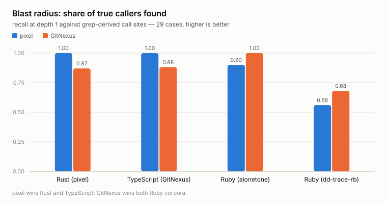

# pixel and the other agent-retrieval tools

Four tools, three different jobs. This page says which one does what, where
pixel wins, and — with the same amount of space — where it loses. Every number
links to the measurement that produced it, and the harnesses are committed so
you can re-run them on your own repository.

Measured 2026-09-21 on an Apple M2 / 16 GiB: pixel 0.4.0, **GitNexus 1.6.12**
(`737634705`), **semble 0.6.0**, **stacklit** (`6aa0176`). Newer versions may
differ. Method and raw data:
[`bench/vs-gitnexus.md`](bench/vs-gitnexus.md) (graph capabilities) and
[`bench/vs-landscape.md`](bench/vs-landscape.md) (search, map, context cost).

## They are not substitutes

| | [GitNexus](https://github.com/abhigyanpatwari/GitNexus) | [semble](https://github.com/MinishLab/semble) | [stacklit](https://github.com/glincker/stacklit) | pixel |
|---|---|---|---|---|
| Blast radius / call graph | yes | — | no, by design | yes |
| Semantic code search | flows, not files | **its whole purpose** | — | yes, weaker |
| Compact repo map | — | — | **its whole purpose** | yes, weaker |
| Git history archaeology | — | — | — | **yes** |
| Repo operations (commit, push, branch) | — | — | — | **yes** |
| Cypher / PDG / taint / API route maps | **yes** | — | — | — |
| Language | TypeScript | Python | Go | Rust |
| Licence | PolyForm **Noncommercial** | MIT | MIT | MIT |

If you only need one job done, the specialist usually wins it. pixel's case is
that an agent needs several of these jobs in one session, from one tool, with
one index and one uncertainty model.

## Start here: the licence

GitNexus ships under [PolyForm Noncommercial
1.0.0](https://polyformproject.org/licenses/noncommercial/1.0.0) — noncommercial
use only; commercial use needs a separate arrangement with its author. semble,
stacklit and pixel are all MIT. If you are evaluating for a company, check this
before any benchmark on this page.

## Where pixel wins

<picture>
  <source media="(prefers-color-scheme: dark)" srcset="bench/charts/impact-recall-dark.svg">
  
</picture>

**Blast radius on Rust and TypeScript.** Across 29 hand-verifiable cases, pixel
returned every true caller on both languages (recall 1.00 / 1.00) against
GitNexus' 0.87 / 0.88 — including on GitNexus' own TypeScript codebase.
Answers arrive ~2.8× faster (153 ms vs 432 ms p50) and 2.4× smaller (4.5 KB vs
11.0 KB). ([measurement](bench/vs-gitnexus.md#blast-radius-impact--impact--29-cases-4-repos-3-languages))

**Git history as a first-class surface.** `search-history`, `dig-history`,
`file-history`, `who-wrote`, `plan-rollback` — "when did this break", "who owns
this", "what was the last good version", from an indexed history. None of the
other three implements this.

**Repo operations in the same tool.** `repo-state`, `review-changes`, `commit`,
`push`, `sync-branch`, `list-branches`, `fast-forward` — crash-safe and
idempotent, so an agent that dies mid-operation does not leave a half-committed
tree. None of the other three implements this.

**Compact answers.** 3.5× fewer bytes per search result than semble, 2.4× fewer
than GitNexus on impact. pixel's answers are consistently the cheapest to read.

**Stated uncertainty.** Every graph answer carries `epistemics`: `closed_world`
is always `false`, `lower_bound` flags unresolved call sites. This is not
cosmetic — in the two cases where pixel loses worst below, its own output
announced the problem.

## Where pixel loses

These are measured, on the same corpora, with the same harnesses.

<picture>
  <source media="(prefers-color-scheme: dark)" srcset="bench/charts/retrieval-recall-dark.svg">
  
</picture>

**Semantic search: semble is better overall.** Over 45 doc-comment-derived
queries across Rust, TypeScript and Ruby, semble found the right file in its top
10 in 100 % of cases against pixel's 69 %, and was ~1.7× faster. The gap is not
uniform: on Rust the two tie at 100 %, and pixel actually ranks the right file
first more often (87 % vs 67 %); on TypeScript pixel manages 27 %. If
natural-language search across mixed languages is your main need, install
semble.
([measurement](bench/vs-landscape.md#natural-language-retrieval--semble-vs-pixel-45-queries))

<picture>
  <source media="(prefers-color-scheme: dark)" srcset="bench/charts/map-cost-coverage-dark.svg">
  
</picture>

**Compact repo map: stacklit is better on most repos.** 372 tokens for 69 % of
pixel's own directories, against `pixel list-areas` at 2 392 tokens for 24 %. It
wins 3 of 4 repos. (Its "~250 tokens" headline holds on small repos only — 2.5–3.1k
on the larger two.) ([measurement](bench/vs-landscape.md#repo-map--stacklit-vs-pixel-4-repos))

<picture>
  <source media="(prefers-color-scheme: dark)" srcset="bench/charts/context-tax-dark.svg">
  
</picture>

**Context cost: pixel is the lightest only against GitNexus.** ~4 160 always-on
tokens vs GitNexus' ~19 700 is a 4.7× win — but semble costs ~980 and stacklit
~420. pixel is 4× and 10× *heavier* than those two. The shape differs (theirs is
MCP schemas you can unregister; pixel's is doctrine that makes a schema-free CLI
usable), but the number is the number.
([measurement](bench/vs-landscape.md#context-tax--what-each-costs-before-answering-anything))

**Ruby.** GitNexus finds callers pixel misses (recall 1.00 vs 0.90, 0.68 vs
0.56). pixel's graph does not model call sites at the **top level of Ruby script
files** (`appraisal/*.rb`, `db/seeds/*.rb`) — no enclosing symbol to attach the
edge to. Its text index has those lines and `find-symbol` prints
`lower bound — N same-name call site(s) unresolved`, but `impact` returns nothing.
Ruby-heavy codebase with significant top-level script code: this will bite you.

**Noisy answers on dynamic Ruby.** Asked about `application` in dd-trace-rb,
pixel returns 8 files at depth 1 and not one is a caller; GitNexus returns none.
Eight confident wrong answers cost an agent more than silence. (An earlier
revision reported a corpus-level precision loss, 0.85 against 0.89. That figure
averaged in the two Ruby corpora, whose truth sets are incomplete by
construction, and is withdrawn — over the 16 cases where precision is scorable,
pixel leads 0.98 to 0.94.)

**Ignored files can leak into search results.** A file created after the last
full `build-index` is picked up by the live overlay refresh with no git ignore
rules applied — `.gitignore` and `.git/info/exclude` leak alike — and stays
queryable until the next rebuild. Found while building this benchmark; run
`pixel build-index` after generating files you do not want indexed.

**Program analysis pixel does not have at all.** Raw Cypher over the graph,
persisted PDG with taint findings, API route/shape/impact maps, multi-repo
contract groups, a web UI, generated wikis — all GitNexus, no pixel equivalent.

**Disk, with history.** pixel's comparable index is 8.6 MB against GitNexus'
184 MB on the same repo, but the history database added ~849 MB in that run
(225 MB db + 624 MB WAL). That was before the history index moved to FTS5
trigram indexes and gained a default ceiling of 256 MiB and 365 days of diffs.
On pixel's own repository (918 commits, `du` on `.pixel/history.db*`) the
change took the history database from 383 MB, WAL included, to 25 MB
([#301](https://github.com/LivioGama/pixel/pull/301)); the GitNexus repo has
not been re-measured since. History is built only when a history command runs.

## Running them together

Nothing here requires an exclusive choice, and the combinations that make sense
are obvious from the table: **semble for search, pixel for graph, history and
git ops** costs ~5 100 always-on tokens and beats either alone on its own axis.
Adding stacklit's map is another ~420.

One installer caveat: **`pixel install` deletes GitNexus' generated section**
from `CLAUDE.md` and `AGENTS.md` (the `# GitNexus — Code Intelligence` block and
its subsections — `crates/pixel-install/src/config.rs`, `strip_stale_blocks`).
It is regenerable with `gitnexus analyze`. Removal is bounded to a real
generated section header, so hand-written prose that merely mentions GitNexus
survives verbatim; there is a regression test for that case. pixel's hook router
also recognises GitNexus' passive Claude context hook and coexists with it
(`crates/pixel-install/src/routing.rs`). semble and stacklit are untouched.

`pixel uninstall` removes everything `pixel install` wrote and is idempotent. It
does not restore the GitNexus block.

## Command mapping

| GitNexus | semble | stacklit | pixel |
|---|---|---|---|
| `impact` | — | — | `pixel impact` |
| `trace` | — | — | `pixel call-path` |
| `context` | — | — | `pixel pack-context` / `find-symbol` |
| `detect_changes` | — | `stacklit diff` | `pixel what-changed` |
| `query` | `semble search` | — | `pixel search-meaning` / `find-code` |
| — | `semble find_related` | — | no equivalent |
| — | — | `stacklit derive` | `pixel list-areas` / `repo-map` |
| — | — | `get_dependencies`, `get_hot_files` | partial (`list-flows`, `who-wrote`) |
| `analyze` | implicit on first search | `stacklit generate` | `pixel build-index` |
| `cypher`, `pdg_query`, `explain` | — | — | no equivalent |
| `route_map`, `shape_check`, `api_impact` | — | — | no equivalent |
| `group_list`, `group_sync` | — | — | no equivalent |
| — | — | — | `search-history`, `dig-history`, `file-history`, `who-wrote`, `plan-rollback` |
| — | — | — | `repo-state`, `review-changes`, `commit`, `push`, `sync-branch` |
| — | — | — | `scope-task`, `plan`, `note`, `recall` |

## Verify this yourself

Nothing above asks to be taken on trust. The ground truth is derived from your
source — call sites by grep, queries from your own doc comments — so no tool can
be right by construction:

```sh
git clone https://github.com/LivioGama/pixel && cd pixel
export GITNEXUS_CLI=/path/to/GitNexus/gitnexus/dist/cli/index.js   # or `gitnexus` on PATH

# blast radius, against grep-derived call sites
python3 scripts/bench-vs/gen-truth.py /path/to/repo rust 8 target,tests > cases.json
python3 scripts/bench-vs/bench-impact.py /path/to/repo cases.json

# retrieval, against the repo's own doc comments
python3 scripts/bench-vs/gen-queries.py /path/to/repo rust 15 target,tests > q.json
python3 scripts/bench-vs/bench-retrieval.py /path/to/repo q.json "$(command -v semble)"

# repo map: size vs coverage
python3 scripts/bench-vs/bench-map.py /path/to/repo "$(command -v stacklit)"
```

The parameters behind the committed fixtures are recorded in
[`docs/bench/vs-gitnexus/cases/REGENERATE.md`](bench/vs-gitnexus/cases/REGENERATE.md);
the Ruby ones need a wider truth-set window than the defaults.

If pixel loses on your codebase, these harnesses will say so — they did on Ruby,
on search, and on the map.
